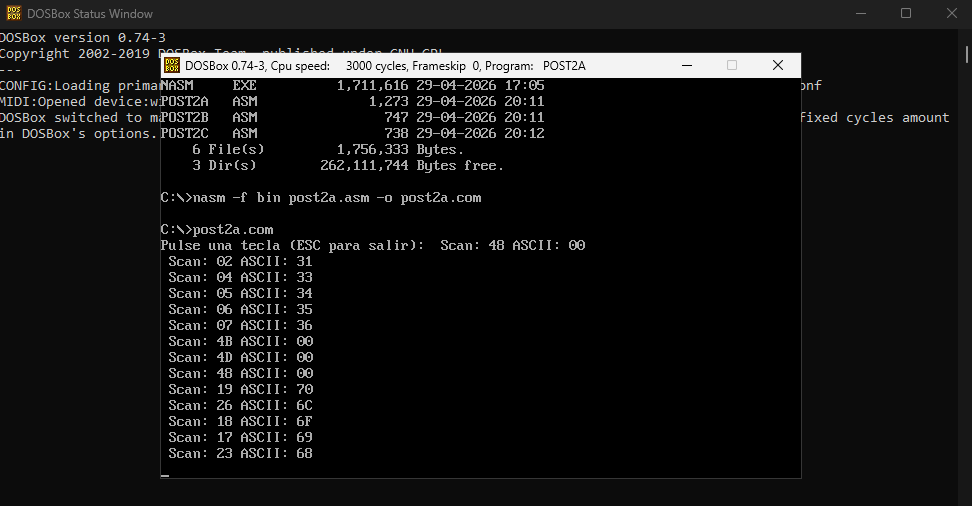
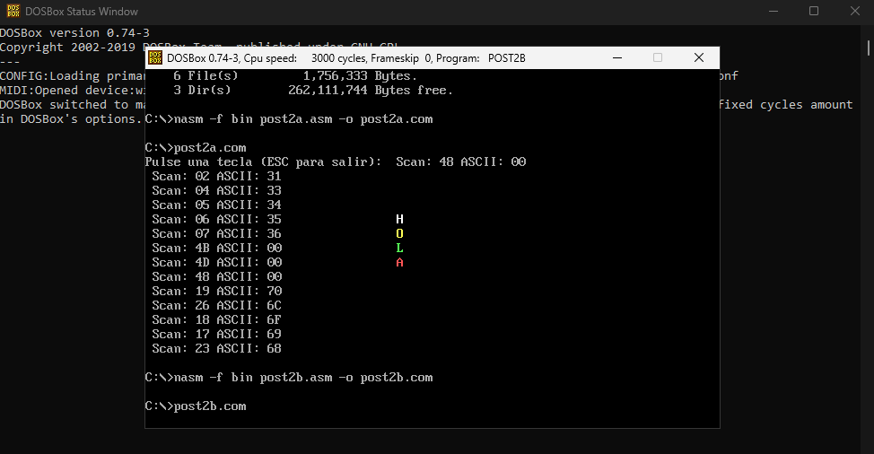
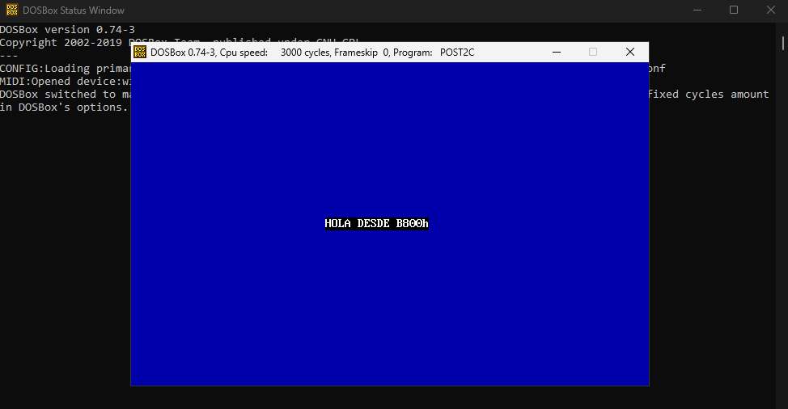

# Arquitectura de Computadores - Unidad 7: Post-Contenido 2

## Datos del Estudiante
* **Nombre:** Obed Ayala
* **Institución:** Universidad Francisco de Paula Santander (UFPS)
* **Programa:** Ingeniería de Sistemas
* **Año:** 2026

## Descripción del Laboratorio
Este laboratorio profundiza en el control de hardware mediante el acceso directo a la memoria de video y la gestión avanzada del teclado. Se implementaron soluciones que omiten las interrupciones del BIOS para la salida de datos, optimizando el rendimiento mediante la manipulación del segmento **B800h** y el uso de **scan codes** para la detección de teclas físicas.

## Conceptos Técnicos Implementados

### 1. Gestión de Teclado (INT 16h)
A diferencia de la interrupción 21h, la **INT 16h** permite capturar el **Scan Code** (código de hardware de la tecla) y el código **ASCII** por separado. Esto es fundamental para detectar teclas extendidas como las flechas de dirección o funciones (F1-F12), donde el valor ASCII suele ser `00h`.

### 2. Segmento de Video B800h
En modo texto ($80 \times 25$), la pantalla está mapeada directamente en la dirección de memoria **B800:0000**. Cada celda de la pantalla utiliza 2 bytes:
*   **Byte de Carácter:** Almacena el código ASCII.
*   **Byte de Atributo:** Define el color de fondo (4 bits altos) y el color del texto (4 bits bajos).
*   **Fórmula de Direccionamiento:** $Offset = (fila \times 80 + columna) \times 2$.

---

## Resultados por Checkpoint

### Checkpoint 1: Lectura de Scan Codes (`post2a.asm`)
Se desarrolló un programa que muestra en tiempo real el código físico de cada tecla pulsada.
*   **Observación:** Al presionar la tecla **Escape**, el programa identifica el Scan Code `01h` y finaliza la ejecución. Las teclas especiales se identifican correctamente por su código en el registro `AH`.

### Checkpoint 2: Escritura Directa en Memoria (`post2b.asm`)
Se implementó la escritura de la palabra "HOLA" calculando manualmente los offsets para diferentes filas.
*   **Resultado:** Las letras aparecen en pantalla sin utilizar servicios de video del BIOS, demostrando que la manipulación directa del segmento **B800h** es efectiva para el control total de la interfaz.

### Checkpoint 3: Optimización con REP STOSW (`post2c.asm`)
Se utilizó la instrucción de cadena `STOSW` junto al prefijo de repetición `REP` para rellenar la pantalla de color azul.
*   **Ventaja:** Esta técnica es significativamente más rápida que imprimir caracteres uno a uno, permitiendo cambios de fondo instantáneos y sin parpadeo.

### Checkpoint 4: Mini Editor de Texto (`post2d.asm`)
Se integró la lectura de teclado con la escritura en memoria para crear un editor de una sola línea en la fila 12. El programa calcula dinámicamente el offset según la columna actual y permite escribir texto con atributos de color personalizados.

---

## Conclusiones
1.  **Independencia del BIOS:** El acceso directo al segmento **B800h** permite desarrollar software con una velocidad de respuesta superior al evitar las capas intermedias de las interrupciones del sistema.
2.  **Control de Hardware:** Comprender los **Scan Codes** es esencial para el desarrollo de controladores y aplicaciones que requieren el uso de teclas no estándar (como en videojuegos o herramientas de sistema).
3.  **Eficiencia de Instrucciones de Cadena:** El uso de `REP STOSW` demuestra la potencia de la arquitectura x86 para procesar grandes bloques de datos de memoria de video en pocos ciclos de reloj.
